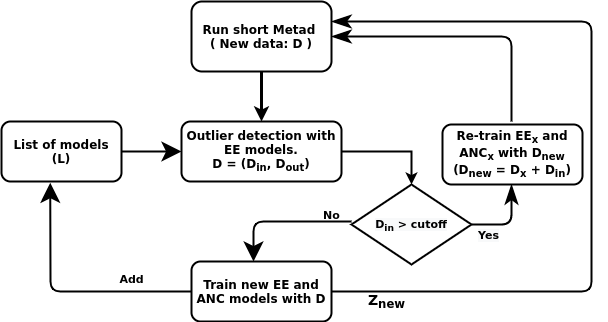
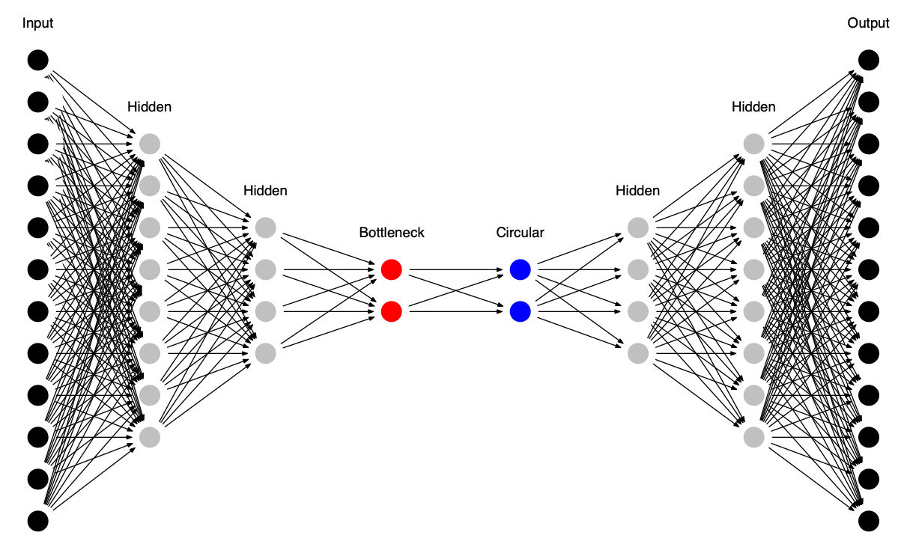
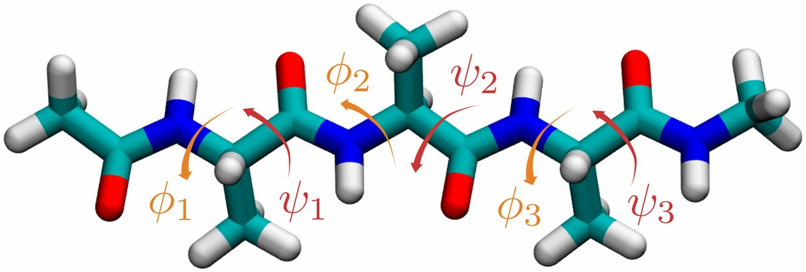

[](https://www.plumed-nest.org/eggs/19/065/)
[](https://opensource.org/licenses/MIT)

# CCRS 

This is the framework for running efficient exploration of complete relevant phase space: Combined Classification and Regression Scheme (CCRS) for on-the-fly collective variable prediction in condensed matter systems.

## Dependencies

OpenMM simulation pacakge: https://github.com/pandegroup/openmm

Keras: https://github.com/fchollet/keras

Tensorflow: https://github.com/tensorflow/tensorflow

MDAnalysis: https://github.com/MDAnalysis/mdanalysis

PLUMED (ANN included): https://github.com/plumed/plumed2 

Some other Python scientific calculation packages (e.g. pandas, sklearn, matplotlib) are also needed, it is recommended to install them with Anaconda: https://www.continuum.io/downloads


## Installation and preparation

No installation is required. You may simply have all dependent packages installed and checkout workflow to run the scripts :-



To understand the regression model see the following image :- 



See the Alanine tetra peptide molecule with the indicated backbone dihedral angles; these angles will be used for machine learning.




## Directory structure

Directories are arranged as follows:

```
${root_dir}/metad-runs: output of all MetaD simulation data (COLAVR, HILLS, Plumed and GRO files)
${root_dir}/ontheflycv-runs: output of all CCRS simulation data (Trained ANC model, Trained EE model, COLAVR, HILLS, Plumed and GRO files)
${root_dir}/scripts: Scripts used to run CCRS framework.
${root_dir}/scripts/anc.py: Regression model script. Also generates the plumed file for the next run.
${root_dir}/scripts/classification.py: Used to run Elliptic Envelope classification method.
${root_dir}/scripts/check_classification.py: Used to check if the data fits a classification model. Cut-off percentage is defined in this script. 
${root_dir}/scripts/extract_basins.awk: Used to find all basins present in ala4 using the dihedral angles. 
```

## Contact

For any questions, feel free to contact kharenavya@gmail.com or prabhakar.b@iiit.ac.in . 